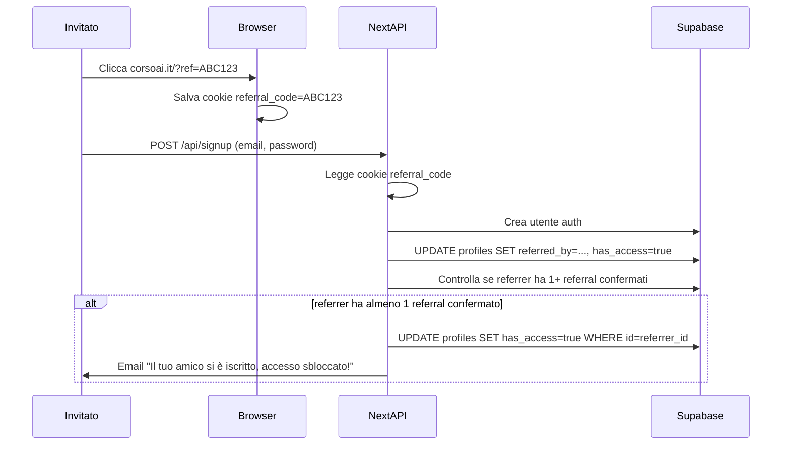

# Referral Virale: Piano di Prodotto

Piano product per la feature di referral (modello asimmetrico): l'invitato ottiene accesso gratis subito; il referrer dopo 1 amico confermato.

---

## Meccanica core (modello asimmetrico)

**Tre attori, tre percorsi:**

- **Referrer**: si iscrive → ottiene link → condivide → al **1° amico confermato** riceve accesso gratis
- **Invitato**: clicca il link → si iscrive → ottiene accesso gratis **immediatamente** (senza aspettare nulla)
- **Organico**: arriva senza link → vede paywall → paga €9.90 OPPURE usa il proprio link referral per invitare 1 amico

Il modello è asimmetrico per design: l'invitato viene sempre premiato subito (massima incentivo a cliccare il link), il referrer deve solo portare 1 persona. Basta condividere su WhatsApp a un amico e siete entrambi dentro.

---

## User Journey Map

### Journey A — Utente organico che vuole invitare

```
Arriva sul sito
   → Legge ep. 1 gratis
   → Urta paywall: "€9.90 — oppure invita 1 amico e accedi gratis"
   → Si registra (email + password)
   → Vede il suo link personale: corsoai.it/?ref=ABC123
   → Copia il link e lo condivide (WhatsApp, social, ecc.)
   → Amico si iscrive via link → accesso sbloccato per entrambi
   → Riceve email: "Il tuo amico si è iscritto, hai accesso gratuito!"
   → Accede al corso
```

### Journey B — Utente invitato

```
Riceve link (WhatsApp/social)
   → Clicca: corsoai.it/?ref=ABC123
   → Il codice referral viene salvato in cookie (7 giorni)
   → Sfoglia il sito, legge l'ep. 1 gratuito
   → Si registra
   → Ottiene has_access = true immediatamente (senza pagare)
   → Vede il suo link personale e può invitare a sua volta
```

### Journey C — Utente che ha già pagato

```
Ha già has_access = true (via Stripe)
   → Vede il proprio link referral in /account
   → Può condividerlo (utile per marketing)
   → Non riceve nessun beneficio aggiuntivo (ha già accesso)
```

---

## Decisioni di Prodotto Aperte → Raccomandazioni

Seguendo il principio "più semplice possibile":

- **Quanti amici?** → **1** (modello asimmetrico)
- **Accesso per l'invitato**: immediato al momento della registrazione via link → **SÌ** (massima viralità: l'amico ha subito un motivo per iscriversi)
- **Accesso per il referrer**: quando il 1° amico conferma l'email → **dopo conferma email**
- **Email confirmation obbligatoria?** → **SÌ**, ma solo per contare come referral valido (previene account fake, costo zero di implementazione con Supabase)
- **Referrer già ha pagato?** → nessun rimborso, nessun beneficio aggiuntivo; il link è visibile in /account ma solo come strumento di promozione
- **Scadenza link referral?** → **nessuna scadenza**
- **Cap referral?** → **nessun cap** (chi porta 10 amici non ottiene nulla in più per sé, ma tutti e 10 gli amici ottengono accesso gratis — più viralità = più iscritti)
- **Catena referral** (A invita B, B invita C): C conta per B, **non** per A
- **Revoca accesso** se un amico cancella l'account? → **no revoca**, accesso permanente una volta concesso

---

## Edge Case da Gestire

| Scenario                                                 | Comportamento atteso                                                              |
| -------------------------------------------------------- | --------------------------------------------------------------------------------- |
| Link referral usato da chi ha già un account (loggato)   | Codice ignorato silenziosamente, nessuna azione                                   |
| Link referral usato da chi ha già pagato                 | Codice ignorato, `has_access` già true, nessun cambio                             |
| Codice referral inesistente/manomesso                    | Ignorato silenziosamente, signup normale                                          |
| Auto-referral (stesso utente con email diversa)          | Non rilevabile al 100%; la conferma email limita gli abusi                        |
| Stessa persona crea 2 account fake                       | Email confirmation richiesta prima di contare; per €9.90 è protezione sufficiente |
| Link condiviso pubblicamente → 100 iscrizioni            | Tutti ottengono accesso gratis (voluto!); il referrer sblocca al 1°               |
| Invitato non conferma mai l'email                        | Non conta come referral valido per il referrer                                    |
| Referrer sblocca ma il suo amico cancella l'account dopo | Accesso non revocato (keep it simple)                                             |

---

## Schema dati (minimo necessario)

Aggiungere alla tabella `profiles` esistente:

- `referral_code` — `text UNIQUE NOT NULL` — codice univoco generato alla registrazione
- `referred_by` — `uuid REFERENCES profiles(id)` — chi ti ha invitato (null se organico)

Nessuna tabella aggiuntiva. Il conteggio dei referral validi è una semplice query:

```sql
-- Basta che sia >= 1 per sbloccare il referrer
SELECT COUNT(*) FROM profiles
WHERE referred_by = :user_id
  AND id IN (SELECT id FROM auth.users WHERE email_confirmed_at IS NOT NULL)
```

---

## Criteri di Accettazione

### AC-1: Generazione codice referral

- Ogni nuovo utente riceve un `referral_code` univoco (8 caratteri alfanumerici) creato automaticamente al momento della registrazione (trigger Supabase o API route)

### AC-2: Tracking del codice nel cookie

- Quando si visita il sito con `?ref=CODE`, il codice viene salvato in un cookie `referral_code` con scadenza 7 giorni
- Il cookie sopravvive alla navigazione e viene letto al momento del signup

### AC-3: Signup via link referral

- Se al momento del signup è presente un cookie `referral_code` valido:
  - Il campo `referred_by` del nuovo utente viene impostato
  - `has_access` del nuovo utente viene impostato a `true` immediatamente
- Se il codice non esiste o appartiene all'utente stesso: signup normale, nessun accesso gratuito

### AC-4: Sblocco del referrer

- Quando un invitato conferma la propria email, il sistema controlla se il referrer ha ora ≥ 1 referral confermato
- Se sì: `has_access` del referrer viene impostato a `true`
- Il referrer riceve una email: "Il tuo amico si è iscritto — hai accesso gratuito!"

### AC-5: UI — Paywall

- Il paywall mostra due opzioni chiare: paga €9.90 **oppure** invita 1 amico e accedi gratis
- Il link referral è visibile e copiabile con un click (pulsante "Copia link")
- Mostra lo stato: "In attesa del tuo amico" oppure "Accesso sbloccato!"

### AC-6: UI — Pagina /account

- Mostra il link referral dell'utente
- Mostra lo stato del referral (anche per chi ha già pagato, per promuovere il corso)

### AC-7: Idempotenza

- Se `has_access` è già `true`, nessuna operazione ridondante viene eseguita
- Il webhook Stripe esistente non viene alterato

---

## Sequenza tecnica (per la fase di implementazione)



---

## File da toccare nell'implementazione

- `supabase/migrations/` — nuova migration per aggiungere `referral_code` e `referred_by` a `profiles`
- `src/app/api/` — nuova route `POST /api/referral/claim` oppure logica integrata in signup
- `src/lib/auth.ts` — aggiungere helper `getReferralStats(userId)`
- `src/components/` — nuovo componente `ReferralCard` (link + contatore)
- `src/app/account/page.tsx` — integrare `ReferralCard`
- Paywall esistente — aggiungere sezione referral con CTA
